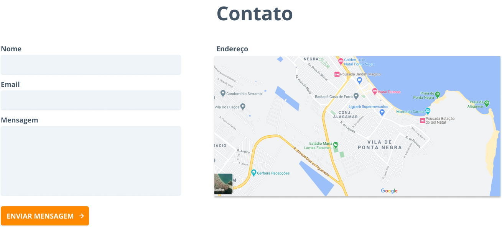

## Projeto Pousada

[Veja a Aplicação em produção](https://pousada.netlify.app)

Este projeto é uma avaliação para uma NAC da FIAP para a disciplina **Digital Experience Platform**.

Integrantes:

- [Abraão Azevedo Oliveira Silva](https://github.com/azabraao) - RM: 83983
- [Geovanne Amorim Coelho](https://github.com/geovannecoelho) - RM82578
- [Iago Monteiro Garcia](https://github.com/iago-monteirog/) - RM82448
- [Rodrigo Sussumu Tanaka](https://github.com/rodsussumu) - RM83888


## Para fazer rodar o projeto

No diretório clonado, rode:


```bash
npm install
```

Este comando vai instalar todas as dependências listadas no package.json.


### Para iniciar o projeto localmente:

```bash
npm start
```

Já irá iniciar a aplicação em sua página inicial, em seu navegador padrão.

### Explicações do design de cada tela

### Para uma melhor experiência, acesse o design no Figma - https://www.figma.com/file/VpffhbF84tI4M4pq9306bi/Cative?node-id=15%3A48

- Home
   - [Navbar] - Menu da pousada.
	

   - [Slide] - Slide de imagens dos quartos disponíveis.
    	 

  - [Box-Reserva] - Box de solicitação de reserva, Check-in / Check-out da pousada. 
    	
  
  - [Sobre] - Descrição sobre a pousada.
    	

  - [Quartos] - Tipos de Quartos, Vip e Apartamento.
    	

  - [Paralax] - Banner de efeito.
    	

  - [Localização] - Localização da pousada.
    	

  - [Footer] - Footer e Diretos reservados.
    	
  
- Quartos

  - VIP
      
  
  - Apartamento
      

- Finalização de Reserva
  
  - [Insira seu nome para finalizar a solicitação & Valor total dos dias inseridos]
      
      
  - Validação ao usúario após concluir a reserva, retornando o nome do mesmo.
      
      
- Contato

  - Formulário para cliente entrar em contato.
    
  


